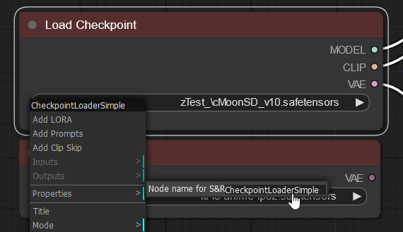
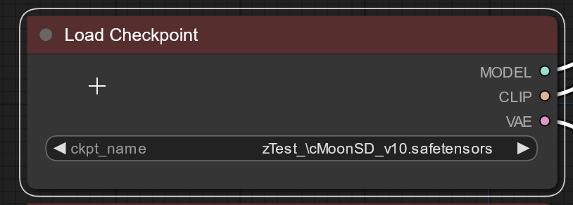

# wyrde's basic basics of comfy workflows

## Keyboard shortcuts

```
    Ctrl + A       = select all nodes
    Ctrl + M       = mute/unmute selected nodes
    Ctrl + C       = copy selected nodes
    Ctrl + V       = paste node buffer
	Ctrl + Enter   = Adds current workflow to queue
    Delete         = delete selected nodes
    Backspace      = delete selected nodes
    Space Bar      = drag viewing area (hold space bar and move mouse pointer)

```
Notes:
* Ctrl + X does nothing.
* muted nodes don't process and block everythintg behind them 
* Ctrl+C, Ctrl+V, Ctrl+X, work normally inside a text box/field
* The text areas are like a separate layer. Space and copy/paste functions act normal inside them and use comfyUI functions outside.

## Organization
* ~~Add pythongosssss _Node Templates_ [from this repo](https://github.com/pythongosssss/ComfyUI-Custom-Scripts). Download the node-templates file and put it in `ComfyUI/web/extensions/`. (Don't copy paste the editor display, save the raw file.) This repo has some other super helpful extensions as well.~~ Templates are now in ComfyUI.
  * I still recommended _image-feed_ and workflow-svg from [the repo](https://github.com/pythongosssss/ComfyUI-Custom-Scripts)
* noodles (the wires) can be organized with _reroute_ nodes. It takes extra time, but it makes figuring out a workflow a few days later much easier. Much less someone else.
* _SaveImage_ can do sub folders. The format is `folder/imageprefix`.
* The _LoadImage_ node is (at this writing) too small. Drag the bottom down to show the image preview. Glory at the terrible sketch comfy made for an example!

## Filenames
**Prefix**
Output files can be customized with substitutions
```
%date:d-M-yy%
```
all the date variables:
```
    yy -> last 2 digit of year (23)
    yyyy -> full year format (2023)
    d -> day number
    M -> month number
    h -> hour
    m -> minute
    s -> second
```
* Put in a `/` to create a folder like `%date:d-M-yyyy%/ComfyUI`
* `%width%` and `%height%` are also supported.
* Various items from nodes can also be included. Right click on a node, click on `properties` and use the contents of the _Node name for S&R_ property and the name of the _data_field_.
  * Example of putting the checkpoint in the file name:
  * The _node names for S&R_ is `CheckpointLoaderSimple` 
  * The _data_field_ is `ckpt_name`
  * combine with a `.` between: `CheckpointLoaderSimple.ckpt_name`
  * wrap the whole thing with `%` at the ends: `%CheckpointLoaderSimple.ckpt_name%`
  * and put that in the *filename_prefix* of the _Save Image_ node
	
* each substitution gets its own %marks. Example: `%date:yyyy-M-d%/%node.data%_%node2.data2%`

**Suffix**
* ComfyUI adds the suffix of an underscore, 5-digit number, underscore, and extension at the end of the file name automatically (`_NNNNN_.png`).

<sub>Thanks to _Davemane42_ for pointing this out!</sub>

## Tips and Philosophy

* ComfyUI has a philosophy of keep it simple. Don't try to create a "do it all" workflow, instead focus on a specific objective.
* use the _CheckpointLoaderSimple_ node to load checkpoints. It will auto pick the right settings depending on your GPU.

##
This directory conatains some basic workflows showing beginning principles. Think of them as badly organized tutorials.

Be sure to check out the [comfy examples](https://comfyanonymous.github.io/ComfyUI_examples/) as well!

* [WAS Starting Workflow](./was-nodes-start/)


<p align="right"><a href="../../..">[home]</a></p>
