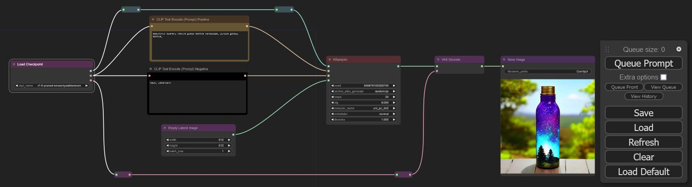

# Building on the Basics

A series of workflows to teach some of ComfyUI's basics.

## The Beginning

* <a href="basic-workflow-v03.json">basic-workflow .json file</a>  

Once ComfyUI is installed and running, adding workflows is as easy as dragging and dropping images or workflows created by ComfyUI into the empty area of the browser window. 

To follow along with this tutorial, download [the workflow](https://raw.githubusercontent.com/wyrde/wyrde-comfyui-workflows/main/basics/building-up/basic-workflow-v03.json) and save it. Then use the `[  Load  ]` button in ComfyUI to load it.

This basic workflow generates an image based on the positive and negative prompts.
* processing starts with the "checkpoint", which is loaded by the Load Checkpoint node on the left.
* Information from the chekcpoint is sent to the two clip boxes, along the node path, and along the model path.
* The clip text encode node attached to the KSampler's _positive_ input in the _Positive Prompt_.
* The clip text encode node attached to the KSampler's _negative_ input in the _Negative Prompt_.
* The Empty Latent Image is the "starting image", is a blank bit of noise. Rather like a painter's canvas.
* The _Model_ is all the raw information _Stable Diffusion_ uses through the Sampler to resolve noise into images.
* I don't know what the fuck VAEs are, but they're important.
  * all models contain a VAE, but not all models have a good VAE.
  * an external VAE can be added to the workflow through a VAE laoder, see below.
* The _KSampler_ node has a number of options. I won't go over all of them here, but for right now the most important are:
  * The _Seed_ is a number used for randomness. All things being equal, a workflow with the same seed will spit out the same image.
  * If the seed doesn't change and nothing else changes, ComfyUI won't even process the workflow. The result is the same as last time. If nothing else changes and the seed does, then new images will be generated. They can vary wildly from one to the next.
  * This makes it easy to tell if nothing has changed.
  * The line under the seed is how new seeds are generated.
    * fixed: they aren't. Seed stays the same. Useful for checking othetr parameters and generating the same basic image.
	* Increment/Decriment: the seed changes by +/- 1.
	* Random: Holdy Changing Numbers, Batman!
  * values are changed by clicking the arrows to scroll through the options or clicking directly on a value to see a list.

Before an image can be generated, a model is needed. Go ahead and select `v1-5-pruned-emaonly.safetensors`
* What, don't have it? Well, [get it from here](https://huggingface.co/runwayml/stable-diffusion-v1-5/tree/main).
* Don't click the file name, it leads to a web page. Click on the right to download the file. 
* Place the file in `ComfyUI\models\checkpoints\`

Click "Queue Prompt" in the box on the side of the window to generate an image. If the same settings are used from the workflow above, it'll look remarkably like  

* if it doesn't then, umm, oopse?
* if there are errors on the screen, then the model is likely not selected
  * or a noodle is disconnected
* if there are errors in the console window, then other things are wrong.

	
## Adding a Vae Loader

* <a href="basic-workflow-vae-v03.json">workflow + vae.json file</a>  

There are three primary ways to add nodes
  * noodle dragging
    * left click and drag from a node's output dot. A noodle appears.
	* Drag the noodle to a nice spot and let go.
	* A slection box with nodes of the same type will appear.
  * Double Click
    * Double Left Click on an empty spot and a list will appear.
	* scroll through the list or start typing to filter it.
	* select the desired node
  * Right Click Menu
    * right click on an empty place on the canvas
	* a context menu appears
	* left click on add node for the nodes submenu
	* Left click on the submenu for the node desired for a list of nodes or more menus

For a VAE Loader
* Right click. Add node → loaders → Load VAE
* double left click, type VAEL and select it
* a noodle can be pulled from the _VAE Decode_ node's input and dropped to show a Vae Loader in the menu, but that'll be messy. Let's save messy workflows for crazy vixens like comfy and mike.
* Go ahead and place a vae

Download a VAE from [stabilityai](https://huggingface.co/stabilityai/sd-vae-ft-mse-original/tree/main) and drop it in `ComfyUI\models\vae`. Get the pruned.safetensors file.
  * Don't click the filename (it results in a page that is confusing until eyes finally spot the "download" link), click to the right. .
  * Drop the file in `ComfyUI\models\vae\`
  * Once it is downloaded, hit F5 and refresh the window so Comfy knows the file is there.
  * With one vae, it is easy to pick in the VAE Loader by clicking on arrows or the list.

In this particular case, there isn't a huge difference in making a new version with the vae linked. For an idea of what differences vae make, check out [this comparison](https://github.com/wyrde/wyrde-comfyui-workflows/tree/main/compare/model-vae). The ones with bad vae are faded and washed out. Good vae are vibrant.

Note
* Automatic1111's method of matching vae file names to models and placing them in the model folder doesn't matter to ComfyUI. Either the VAE is loaded directly or the one built into the model is used.
* [Here's some good info on VAE](https://rentry.org/sdvae)

## Adding a Lora

* <a href="basic-workflow-vae-lora.json">workflow + vae + lora.json file</a>  

Lora (and the varients) are cool mini-models that are used to alter a bigger model. Think of them like the trojan horse, but everyone is happy with the result. Usually.

[here's a lora](https://civitai.com/models/44960?modelVersionId=49584) to test with. Drop it in the `ComfyUI\models\lora\` folder.
* as with other files, hit F5 to refresh the file lists
* ignore the text in the lora page for now, what is first seen is for version 3.0 and version 1 is what we're using.

Adding a lora is a bit more tricky than a vae loader, because they go between the model and the Ksampler.
* Unlike automatic1111, the lora aren't put in the prompt.

Make a little room for the _lora Loader_ node.
* Between the _CLIP Text_ nods and _Load Checkpoint_ hold down the control key and drag with the left mouse button. It will draw a box. When Left Mouse is released, everything inside the box is selected.
* Now hold down shift and Left Click one of the selected nodes. All the nodes will be dragged as a group when the mouse is dragged.
* It is better to make room by dragging nodes right than left
* Refreshing (F5) the window zooms to the barely visiable blue box where the beginning nodes are.
* it gets annoying to pan left all the time

Now drop a _Lora Loader_ in the empty spot.
* Connect the _Load Checkpoint_ model and clip outputs to the Load Lora.
  * The _Load LoRA_'s model output goes to the model reroute (to the KSampler model input)
    * this will autmatically detach it from the Load Checkpoint.
  * The _Load LoRA_'s CLIP output is noodled to both the CLIP nodes' inputs.
    * this will autmatically detach them from the Load Checkpoint.
* Select _mPixel_v10pixelArt.safetensors_ for the lora_name field.
* change strength_model and strength_clip to 0.8

## HiRez Fixing

## Expanding on Fixing

## Upscaling

* images
<!--  -->

## resources

<!-- things people might want to duplicate results -->

Model
* https://civitai.com/models/4384/dreamshaper

Lora
* https://civitai.com/models/8858/maplestory2game-chibi-style-hn
* https://civitai.com/models/21670/astrobabes
* https://civitai.com/models/25803/battle-angels

Embeds
* EasyNegative https://civitai.com/models/7808/easynegative
* bad-hands-5 https://huggingface.co/yesyeahvh/bad-hands-5/tree/main

Custom Nodes
* [WAS Suite](https://github.com/WASasquatch/was-node-suite-comfyui)

<!-- will likely forget to doublecheck this -->

<a href="..">[back]</a><a href="../../../.."> [home]</a>

