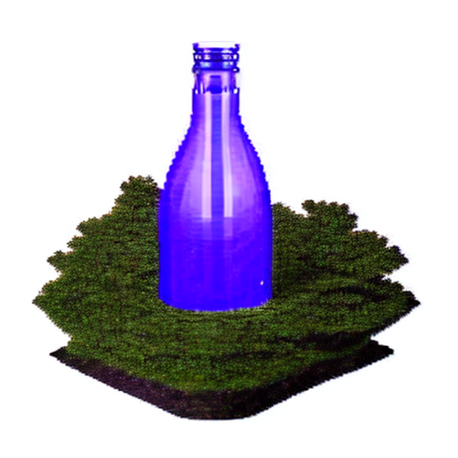
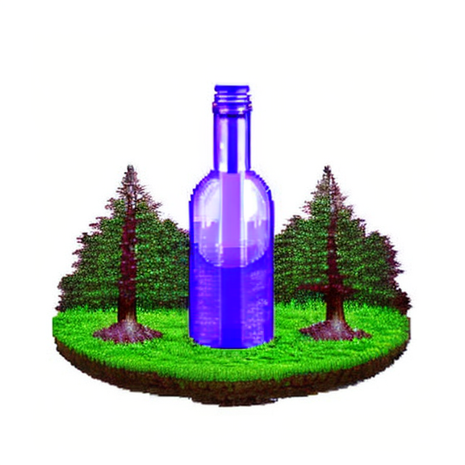

# Building on the Basics

A series of workflows to teach some of ComfyUI's basics.

## The Beginning

* <a href="basic-workflow-v03.json">basic-workflow .json file</a>  

Once ComfyUI is installed and running, adding workflows is as easy as dragging and dropping images or workflows created by ComfyUI into the empty area of the browser window. 

To follow along with this tutorial, download [the workflow](https://raw.githubusercontent.com/wyrde/wyrde-comfyui-workflows/main/basics/building-up/basic-workflow-v03.json) and save it. Then use the `[  Load  ]` button in ComfyUI to load it.

This basic workflow generates an image based on the positive and negative prompts.
* processing starts with the "checkpoint", which is loaded by the Load Checkpoint node on the left.
* Information from the chekcpoint is sent to the two clip boxes, along the node path, and along the model path.
* The clip text encode node attached to the KSampler's _positive_ input in the _Positive Prompt_.
* The clip text encode node attached to the KSampler's _negative_ input in the _Negative Prompt_.
* The Empty Latent Image is the "starting image", is a blank bit of noise. Rather like a painter's canvas.
* The _Model_ is all the raw information _Stable Diffusion_ uses through the Sampler to resolve noise into images.
* I don't know what the fuck VAEs are, but they're important.
  * all models contain a VAE, but not all models have a good VAE.
  * an external VAE can be added to the workflow through a VAE laoder, see below.
* The _KSampler_ node has a number of options. I won't go over all of them here, but for right now the most important are:
  * The _Seed_ is a number used for randomness. All things being equal, a workflow with the same seed will spit out the same image.
  * If the seed doesn't change and nothing else changes, ComfyUI won't even process the workflow. The result is the same as last time. If nothing else changes and the seed does, then new images will be generated. They can vary wildly from one to the next.
  * This makes it easy to tell if nothing has changed.
  * The line under the seed is how new seeds are generated.
    * fixed: they aren't. Seed stays the same. Useful for checking othetr parameters and generating the same basic image.
	* Increment/Decriment: the seed changes by +/- 1.
	* Random: Holdy Changing Numbers, Batman!
  * values are changed by clicking the arrows to scroll through the options or clicking directly on a value to see a list.

Before an image can be generated, a model is needed. Go ahead and select `v1-5-pruned-emaonly.safetensors`
* What, don't have it? Well, [get it from here](https://huggingface.co/runwayml/stable-diffusion-v1-5/tree/main).
* Don't click the file name, it leads to a web page. Click on the right to download the file. 
* Place the file in `ComfyUI\models\checkpoints\`

Click "Queue Prompt" in the box on the side of the window to generate an image. If the same settings are used from the workflow above, it'll look remarkably like  

* if it doesn't then, umm, oops?
* if there are errors on the screen, then the model is likely not selected
  * or a noodle is disconnected
* if there are errors in the console window, then other things are wrong.

	
## Adding a Vae Loader

* <a href="basic-workflow-vae-v03.json">workflow + vae.json file</a>  

There are three primary ways to add nodes
  * noodle dragging
    * left click and drag from a node's output dot. A noodle appears.
	* Drag the noodle to a nice spot and let go.
	* A slection box with nodes of the same type will appear.
  * Double Click
    * Double Left Click on an empty spot and a list will appear.
	* scroll through the list or start typing to filter it.
	* select the desired node
  * Right Click Menu
    * right click on an empty place on the canvas
	* a context menu appears
	* left click on add node for the nodes submenu
	* Left click on the submenu for the node desired for a list of nodes or more menus

For a VAE Loader
* Right click. Add node → loaders → Load VAE
* double left click, type VAEL and select it
* a noodle can be pulled from the _VAE Decode_ node's input and dropped to show a Vae Loader in the menu, but that'll be messy. Let's save messy workflows for crazy vixens like comfy and mike.
* Go ahead and place a vae

Download a VAE from [stabilityai](https://huggingface.co/stabilityai/sd-vae-ft-mse-original/tree/main) and drop it in `ComfyUI\models\vae`. Get the pruned.safetensors file.
  * Don't click the filename (it results in a page that is confusing until eyes finally spot the "download" link), click to the right. .
  * Drop the file in `ComfyUI\models\vae\`
  * Once it is downloaded, hit F5 and refresh the window so Comfy knows the file is there.
  * With one vae, it is easy to pick in the VAE Loader by clicking on arrows or the list.

In this particular case, there isn't a huge difference in making a new version with the vae linked. For an idea of what differences vae make, check out [this comparison](https://github.com/wyrde/wyrde-comfyui-workflows/tree/main/compare/model-vae). The ones with bad vae are faded and washed out. Good vae are vibrant.

Note
* Automatic1111's method of matching vae file names to models and placing them in the model folder doesn't matter to ComfyUI. Either the VAE is loaded directly or the one built into the model is used.
* [Here's some good info on VAE](https://rentry.org/sdvae)

## Adding a Lora

* <a href="basic-workflow-vae-lora.json">workflow + vae + lora.json file</a>  

Lora (and the varients) are cool mini-models that are used to alter a bigger model. Think of them like the trojan horse, but everyone is happy with the result. Usually.

[here's a lora](https://civitai.com/models/44960?modelVersionId=49584) to test with. Drop it in the `ComfyUI\models\lora\` folder.
* as with other files, hit F5 to refresh the file lists
* ignore the text in the lora page for now, what is first seen is for version 3.0 and version 1 is what we're using.

Adding a lora is a bit more tricky than a vae loader, because they go between the model and the Ksampler.
* Unlike automatic1111, the lora aren't put in the prompt.

Make a little room for the _lora Loader_ node.
* Between the _CLIP Text_ nods and _Load Checkpoint_ hold down the control key and drag with the left mouse button. It will draw a box. When Left Mouse is released, everything inside the box is selected.
* Now hold down shift and Left Click one of the selected nodes. All the nodes will be dragged as a group when the mouse is dragged.
* It is better to make room by dragging nodes right than left
* Refreshing (F5) the window zooms to the barely visiable blue box where the beginning nodes are.
* it gets annoying to pan left all the time

Now drop a _Lora Loader_ in the empty spot.
* Connect the _Load Checkpoint_ model and clip outputs to the Load Lora.
  * The _Load LoRA_'s model output goes to the model reroute (to the KSampler model input)
    * this will autmatically detach it from the Load Checkpoint.
  * The _Load LoRA_'s CLIP output is noodled to both the CLIP nodes' inputs.
    * this will autmatically detach them from the Load Checkpoint.
* Select _mPixel_v10pixelArt.safetensors_ for the lora_name field.
* change strength_model and strength_clip to 0.8

When Queue Prompt is clicked, the image should now be a pixel-art bottle.  

## HiRez Fixing
(Still writing this)

So, an important thing about stable diffusion is the models are trained on small images. 512x512 pixels is the standard size for most SD1.5 based models (768 for a few). SD2.x models can be either 512px or 768px, depending on the one chosen.

But what does that mean for regular users? Most people want a much larger image (1920x1080 for example). The thing is, just changing the Latent Image size to 1920x1080 tends to go horribly, horribly wrong. That's because stable diffusion doesn't really understand "size" or "composition". When it sees a huge canvase size, it tries to fill _every part_ of it with the prompt.
* the previous prompt and configuration with a 1920x1080 size latent:  

But fear not, there are a few techniques to increase image size from 512px to something more grandiose.
* Latent Upscale: this takes a latent image and makes it bigger. The result is okay, but the larger image is missing much of the detail that is possible.
* Pixel space upscale: Tends to look beter than latent upscale, but is still missing details.
* Pixel space upscale with model: There are special models designed for a better upscale result. Some even extrapolate details.
* High Resolution Fixing: Uusually abbreviated to HR-Fix or even furthetr to HRF, this method is a combination of many of the above. It uses many steps, takes longer, but results in high-detail images. There's the added bonuse that stable diffusion can even "fix" broken parts of the image! Sometimes.

What is this latent space vs pixel space thing?
* Latent space is the zone of chaos and randomness stable diffusion works in. These aren't really images like human eyes see, but math-magic representations the computer works with.
* pixel space is an actual image, rendered in pixels. The things human eyes and graphic arts programs like to work with.
* VAE Decoding and Encoding is used to translate a latent image to pixel and back.
* Some proccesses can only be done in latent space (like KSampling) and others only in pixel space (color correction, model upscaling)

There are some caveats to HR-fixing.
* work in as many small steps as you can stand.
* stick to multiples of 64px. This can be challenging with images of different aspect ratios. There are some custom nodes that help with this.
* if the aspect ratio makes multiples of 64px challenging, do the image upscales in pixel space
  * due to the math involved, even then it is best to do multiples of 8 pixels.
* it is better (and faster) to go through many low-resolution latent space samples and _then_ do a large pixel upscale. This gives lots of detail for the pixel upscale to work with.

But first, let's make a basic HR-Fix.
* at the right side of the workflow, move the VAE Decode and Save Image nodes to the right (try and grab the VAE reroute on the bottom too).
  * about as far as the distance they currently occupy, maybe a touch more.
* put a _Upscale Latent_ node next to the Ksampler
* connect the LATENT output on the Ksampler to the Samples input on the _Upscale Latent_ node.
* put a _KSampler_ node between the Upscale Latent and the VAE Decode.
* connect he LATENT output from the _Upscale Latent_ node to the latent_image input on the new _KSampler_ node.
* connect the LATEN output on the ksampler to the samples input on the _VAE Decode_ node.
  * this will also erase the noodle from the old ksampler to the vae decode
* On the Upscale Latent node, increase wideth and hight by 64pixels. This is easy by clicking the arrows on the right, next to the numbers.

But wait! We're not done. The new KSampler still has a bunch of inputs that are empty. That's because the sampler needs to know what to do with the latent image.

See the model rerout hanging out at the corner of the positive prompt?
* lect click to activate it.
* Ctrl-C to clone it.
* move mouse a little to the right (above the older ksmampler is fine)  

* ctrl-V to paste the cloned reroute  

* now connect them

* then drag it right so it is close to the new KSampler  

* and connect it to the model input on the new KSampler

* The reroute is still in the clipboard, so do another ctrl-v below that initial mode reroute.  

* This time, connect the CONDITIONING output from the Positive prompt to the new reroute. The name will change, but not the color.  

* Right Click on the reroute node, left click on Colors, then select Yellow

* repeat the last few steps to make a second reroute for the negative node and change color to black.

* now tidy them up a bit.
* hint: shift-lelft mouse when dragging "snaps" the node to the grid. Makes them easier to place evenly.  

* Shift-Left Click on both the new conditioning nodes to select both of them.  
  

* Contrl-C to clone them to clip board
* Ctrl V a little to the right to paste them on the workflow.  

* Run noodles from the previous conditioning nodes to the new ones.  

* and drag them to the right. They should still be selected, so shift+left mouse will move both of them.  

* then connect them to the inputs for positive and negative.  
  

* The upscale and ksampler should be ready. If you changed the _Empty Latent Image_ node to test out larger sizes, change it back to 512px.
* Click on Queue Prmpt
* Marvel at the slightly larger and more detailed pixel bottle!  
  

But wait! Isn't this bottle somewhat different from before? It sure is! And here is why:
* On the new KSampler, denoise is set to 1.000
* This tells the ksampler to treat the latent image input as if it were a new canvas and to extrapolate the result like a new image.
* adjust the denoise down to more closely match the original latent while still adding detail.
* 0.500 is _generally_ a good number for the first "HR Fix"
* click Queue Prompt again.
* Instead of running the whole workflow, comfyui should start at the second KSampler. This is because the there were no changes earlier in the workflow.  

* if the first ksamnpler runs again, this means
  * the seed changed
  * comfy has been restarted since the last time
  * I don't know what I'm talking about.

So, umm. err...

Why do all the reroutes and color coding? Can't we connect directly from the model and conditioning outputs to the new ksampler?
* Sure can! And while it is easy to tell what's going on now...
* imagine a workflow with a hundred nodes
* now imagine coming back to the workflow a month later or...
* looking at another person's workflow.
* running reroutes, color coding, and keeping things tidy helps considerably!
* besides, using stable diffusion is about making pretty pictures. I like to make pretty workflows, too!

## Expanding on Fixing
(Still writing this too)

## Upscaling
(Still writing this too also)

## Embeddings/Textual Inversions
(Still writing this too also and)

<!--  -->

## resources

<!-- things people might want to duplicate results -->

Model
* https://civitai.com/models/4384/dreamshaper

VAE
* https://huggingface.co/stabilityai/sd-vae-ft-mse-original/tree/main

Lora
* https://civitai.com/models/44960?modelVersionId=49584

Embeds
* EasyNegative https://civitai.com/models/7808/easynegative
* bad-hands-5 https://huggingface.co/yesyeahvh/bad-hands-5/tree/main

Custom Nodes
* [WAS Suite](https://github.com/WASasquatch/was-node-suite-comfyui)

<!-- will likely forget to doublecheck this -->

<a href="..">[back]</a><a href="../../../.."> [home]</a>

