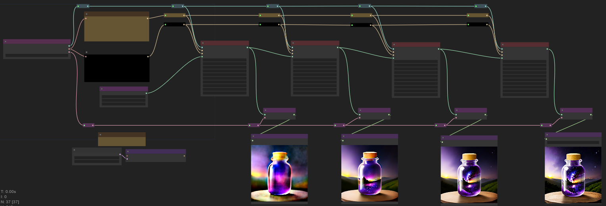
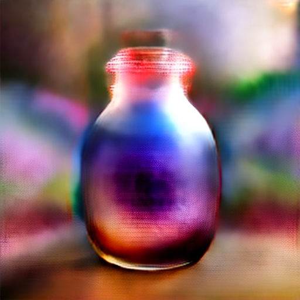

# Preview Example

People new to comfyui often ask if there's a way to preview images. There isn't a node for that yet. Using advanced Ksamplers to split up the latent sampling is the closest thing.

This is also a good example of using the advanced ksampler for splitting samping.

## Sample images

 | step 04 | step 09 | step 14 | step 20 |
 |:-----:|:-----:|:-----:|:-----:|
 |||||

<!--  -->

## resources

<!-- things people might want to duplicate results -->

Model
* [animatrix](https://civitai.com/models/21916)

<!-- will likely forget to doublecheck this -->

<a href="..">[back]</a><a href="../../../.."> [home]</a>

