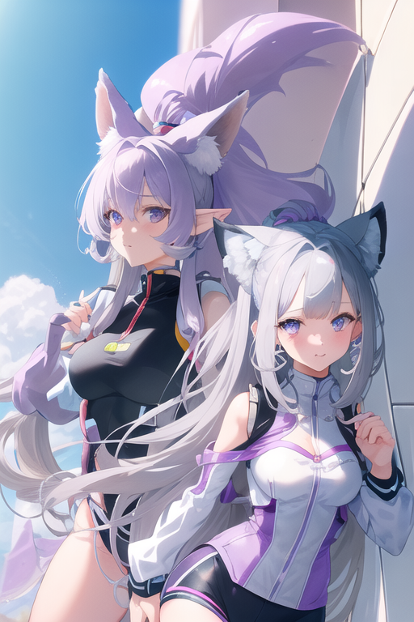
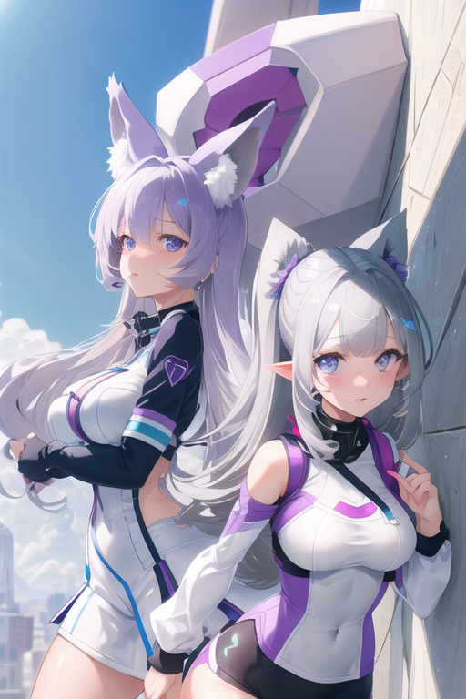
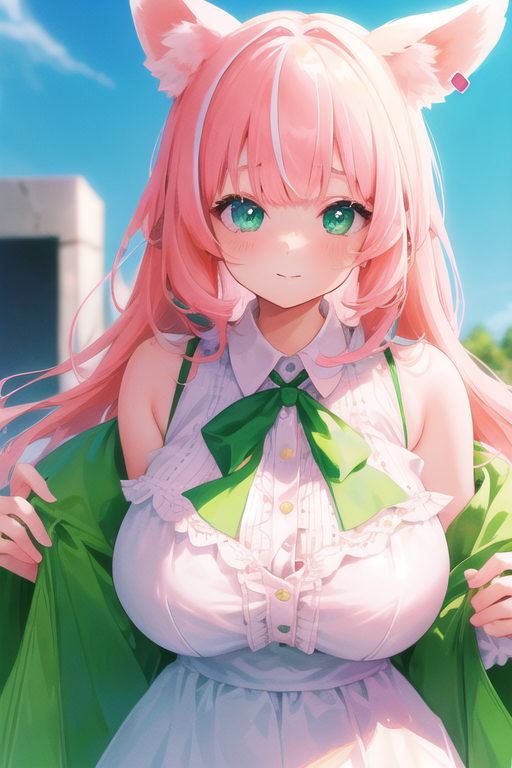
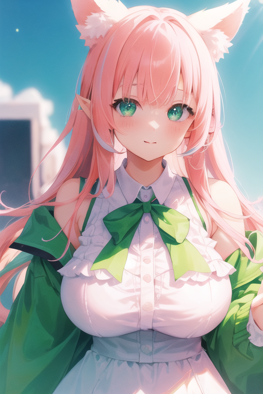
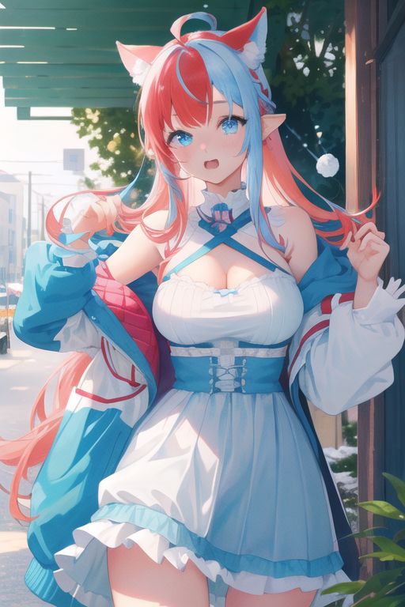
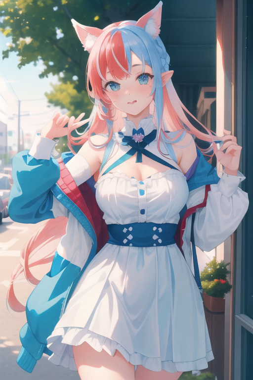
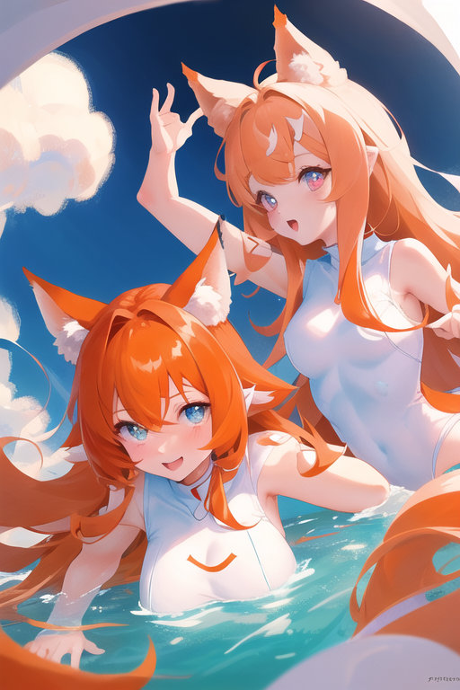

# Using Tokens for Random Values

Makes use of [WAS nodes.](https://github.com/WASasquatch/was-node-suite-comfyui) and omar's [QoL nodes](https://github.com/omar92/ComfyUI-QualityOfLifeSuit_Omar92)
* The WAS nodes are necessary for this example
* The omar "Text _O" nodes can be removed, they're notes and instructions.
* The omar latent upscale by factor nodes can be replaced with any latent upscale.

Tokens are created and then assigned random values from list boxes.

The tokens names are placed in a text box. The contens of the list box are sent to conditioning.

Why do this instead of {curly|braces}?
* In comfyui, words in {curly braces | separated by | pipes are | used to | generate} random results. Due to the way comfyui functions, an image's workflow will contain only the items in the prompt which were evaluated for the image. The rest of the random list is dropped.

Why the text concatenate?
* Because of how the backend evaluates the text boxes, it doesn't know the contents of the tokens have changed when parsing the prompts. There's two ways to fix this:
  * put `{ | | }` in the prompt. It will evaluate the space each time and run the prompt, thus also evaluating tokens.
  * make a new multiline node→random line node→text concatenate (the random result and the prompt) → text parse tokens → text to conditioning
    * this is more complex, but preserves the text prompt in the image workflow.

<!--  -->

## Example Results

* 
* 
* 
* 

<!--  -->

## resources

<!-- things people might want to duplicate results -->

Model
* https://huggingface.co/Vsukiyaki/SukiyakiMix-v1.0

Lora
* https://civitai.com/models/21458/anime-kisses
* https://civitai.com/models/21670/astrobabes
* https://civitai.com/models/25803/battle-angels

Embeds
* EasyNegative https://civitai.com/models/7808/easynegative
* bad-hands-5 https://huggingface.co/yesyeahvh/bad-hands-5/tree/main

Custom Nodes
* [WAS Suite](https://github.com/WASasquatch/was-node-suite-comfyui)
* [omar QoL](https://github.com/omar92/ComfyUI-QualityOfLifeSuit_Omar92)

<!-- will likely forget to doublecheck this -->

<a href="..">[back]</a><a href="../../../.."> [home]</a>

