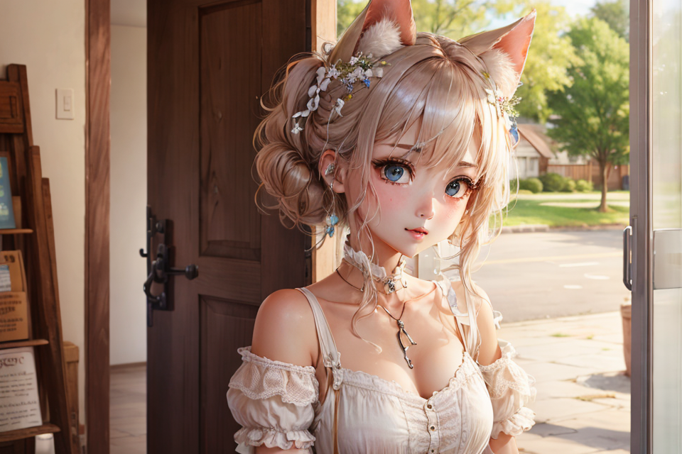
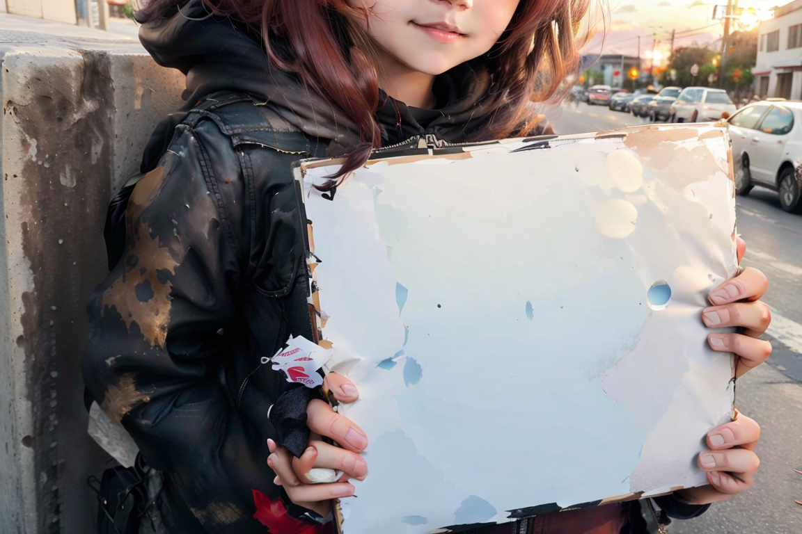

# wyrde's 4-prompt comparision

Uses of [WAS](https://github.com/WASasquatch/was-node-suite-comfyui) and [omar](https://github.com/omar92/ComfyUI-QualityOfLifeSuit_Omar92) nodes.
* Install the suits to avoid a mess of red boxes.

## Comparing Things

Stable Diffusion can be _weird_. Sometimes it helps to examine the weirdness with pretty pictures. This worfklow runs 4 different prompts with the same settings and outputs the image results.

Takes advantage of text boxes, concatenate, and cli output.

## Punctuation in Prompts

### xformers enabled
 | prompt A | prompt B | prompt C | prompt D
 |:----:|:----:|:----:|:----:|
 |`Is, This, Different, Than` | `Is; This; Different; Than` | `Is: This: Different: Than` | `Is. This. Different. Than` |
 |  |  |  | 

### xformers disabled
 | prompt A | prompt B | prompt C | prompt D
 |:----:|:----:|:----:|:----:|
 |`Is, This, Different, Than` | `Is; This; Different; Than` | `Is: This: Different: Than` | `Is. This. Different. Than` |
 |  |  |  | 

  
$\color{pink}{To\ disable\ xformers}$

To disable xformers:
* windows portable standalone
  * add ` --disable-xformers` after `.\python_embeded\python.exe -s ComfyUI\main.py` in the file `run_nvidia_gpu.bat`
  * so it looks llke
  * `.\python_embeded\python.exe -s ComfyUI\main.py --disable-xformers`
* github clone
  * add ` --disable-xformers` to the start command.
  * `python .\main.py --disable-xformers`

## Textual Inversons (embeddings)

Are the "triggers" for textual inversions required in comfyui?

### Style Princess

[style princess](https://civitai.com/models/3485/princess-style)

 | prompt A | prompt B | prompt C | prompt D
 |:----:|:----:|:----:|:----:|
 | `girl in a sunset style-princess` | `girl in a sunset embedding:style-princess style-princess` | `girl in a sunset embedding:style-princess` | `girl in a sunset`
 |||||

### GNTZ

[Style GNTZ](https://civitai.com/models/22544/gntz)

 | prompt A | prompt B | prompt C | prompt D
 |:----:|:----:|:----:|:----:|
 | `girl in a sunset gntz` | `girl in a sunset embedding:gntz gntz` | `girl in a sunset embedding:gntz`  | `girl in a sunset` |
 |||||

Conclusion: not needed, but they do add importance.

## Lora and keywords

 | prompt A | prompt B | prompt C | prompt D
 |:----:|:----:|:----:|:----:|
 |`girl in a sunset `|`girl in a sunset `|`girl in a sunset holding_sign`|`girl in a sunset`|
 | no lora | lora 1,1 | lora 1,1 | lora 0,0 |
 |||||

* tested with [Anime Girls Holding Signs](https://civitai.com/models/42621/)
  * it's a good lora for testing since it is obvious when it is working
* [compare lora workflow](compare-prompt-diff-x4-v0.8-lora.json)

<!--  -->

## resources

<!-- things people might want to duplicate results -->

Model
* animatrix https://civitai.com/models/21916/animatrix

Embedding
* EasyNegative https://civitai.com/models/7808/easynegative
* bad-hands-5 https://huggingface.co/yesyeahvh/bad-hands-5/tree/main

Custom Nodes
* [WAS Suite](https://github.com/WASasquatch/was-node-suite-comfyui)
* [omar QoL suit](https://github.com/omar92/ComfyUI-QualityOfLifeSuit_Omar92)

<!-- will likely forget to doublecheck this -->

<a href="..">[back]</a><a href="../../../.."> [home]</a>

