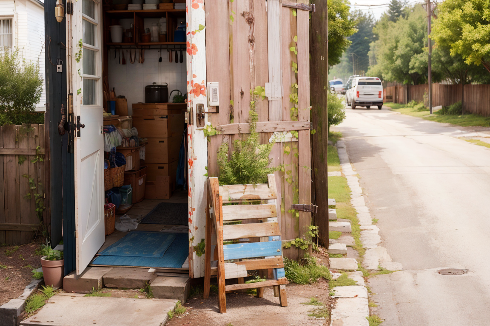

# wyrde's prompt noise comparisons

Uses of [WAS](https://github.com/WASasquatch/was-node-suite-comfyui) and [omar](https://github.com/omar92/ComfyUI-QualityOfLifeSuit_Omar92) nodes.
* Install the suits to avoid a mess of red boxes.

## Comparing Things

Tests showing the noise caused by punctuation

Takes advantage of text boxes, concatenate, and cli output.

## Punctuation in Prompts

 | prompt A | prompt B | prompt C | prompt D
 |:----:|:----:|:----:|:----:|
 |`Is, This, Different, Than` | `Is; This; Different; Than` | `Is: This: Different: Than` | `Is. This. Different. Than` |
 | |||
 | prompt A | prompt B | prompt C | prompt D
 | `,.;` | `,.;,.;` | `,.;,.;,.;,.;,.;,.;` | `,.;,.;,.;,.;,.;,.;,.;,.;,.;,.;` |
 |||| 
 | prompt A | prompt B | prompt C | prompt D
 | ` ` | `,,,,,,` | `......` | `;;;;;;` |
 |||| 
 |||||

## resources

<!-- things people might want to duplicate results -->

Model
* animatrix https://civitai.com/models/21916/animatrix

Embedding
* EasyNegative https://civitai.com/models/7808/easynegative
* bad-hands-5 https://huggingface.co/yesyeahvh/bad-hands-5/tree/main

Custom Nodes
* [WAS Suite](https://github.com/WASasquatch/was-node-suite-comfyui)
* [omar QoL suit](https://github.com/omar92/ComfyUI-QualityOfLifeSuit_Omar92)

<!-- will likely forget to doublecheck this -->

<a href="..">[back]</a><a href="../../../.."> [home]</a>

