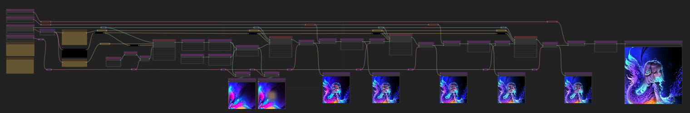
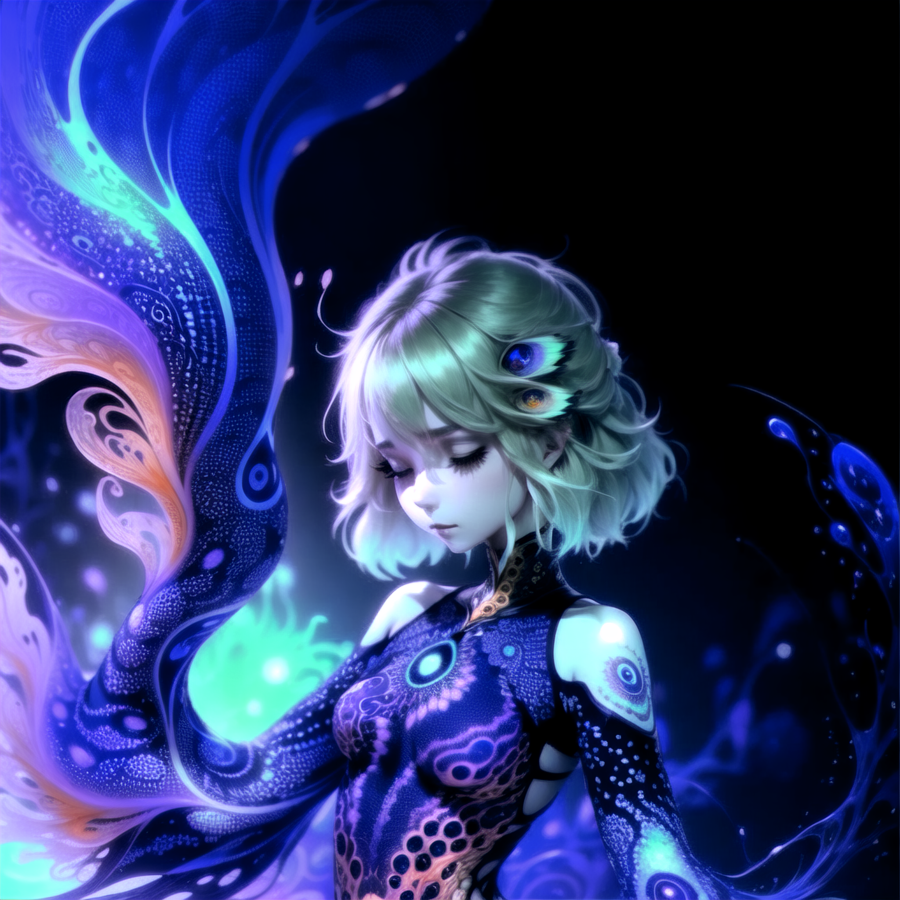
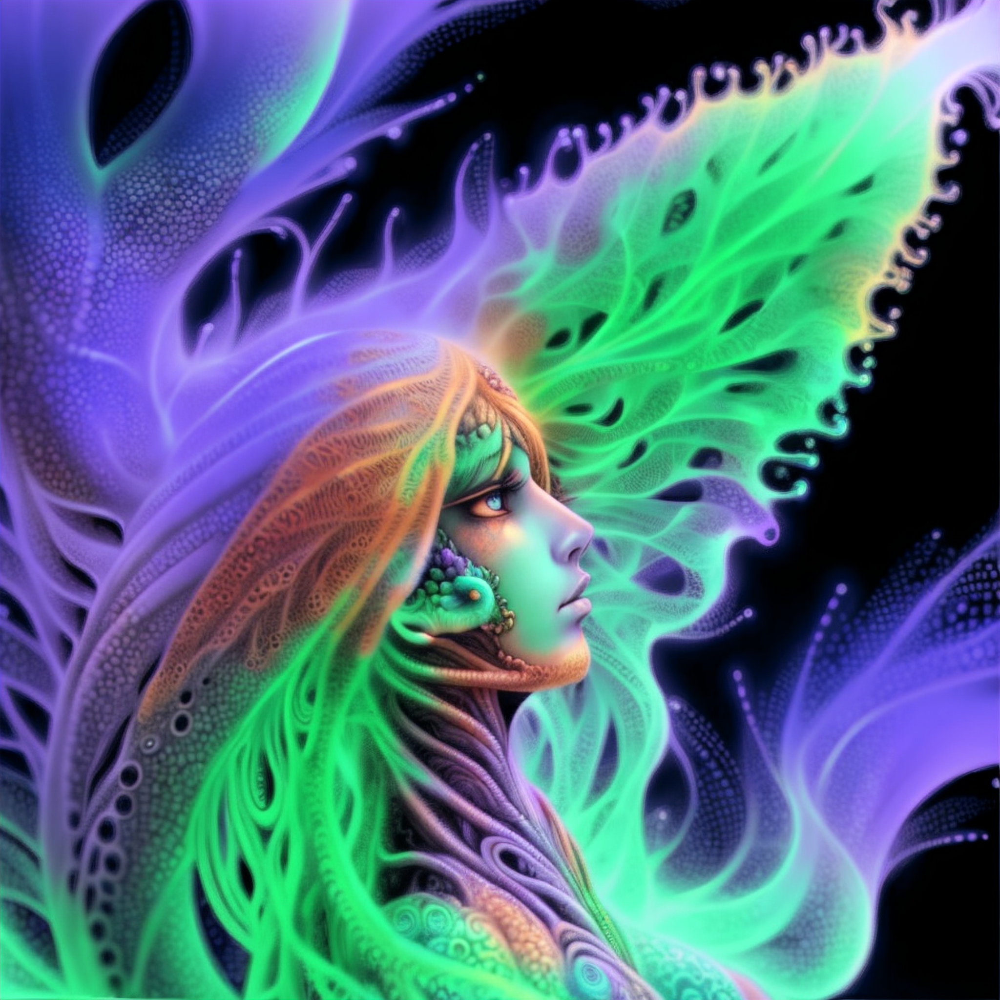

# Fun with Latent Space Painting

<a href="painted-latent-v12.json">painted-latent-v12</a>

## painted latent

Rather than using a "regular" latent, one that is painted or otherwise manipulated can create a striking composition.

This workflow
* creates a latent based on a prompt
* masks part of the latent
* uses a main prompt to generate an image based on the latent
* hi rez fixes the image through a few steps

## Example Results

* wyrde  

 
* tjhayasaka  

* M1r077  

## Experimentation

* set the seed for the latent to random for new latents on each run
* change latent size
* change mask size
* different models and vae
* add lora and embeds/TIs

<!--  -->

## resources

<!-- things people might want to duplicate results -->

Model
* https://civitai.com/models/7371

upscale
* https://drive.google.com/drive/folders/1ldwajXL50uC7PCS63B4Wato6Dnk-svNL
* https://drive.google.com/u/1/uc?id=10h8YXKKOQ61ANnwLjjHqXJdn4SbBuUku&export=download

vae:  
* https://huggingface.co/stabilityai/sd-vae-ft-mse-original/tree/main

Embeds  
* EasyNegative https://civitai.com/models/7808/easynegative
* bad-hands-5 https://huggingface.co/yesyeahvh/bad-hands-5/tree/main

<!-- will likely forget to doublecheck this -->

<a href="..">[back]</a><a href="../../../.."> [home]</a>

