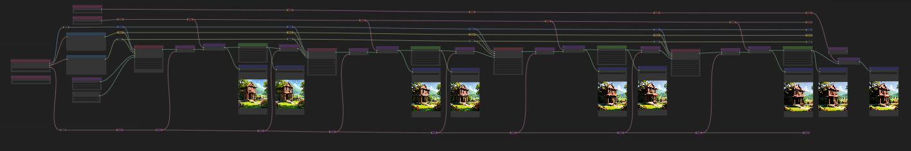

# HiRez Fix Workflows

* Note, these workflows are running on a 1060gtx with 6GB ram. They can be tuned for higher end cards.

## Workflows

Click links for more information. Images have workflows embedded.
* [Branching Sharpening](./branch-sharpen-x6/) 
* [img2img-hr-fix-sharpen-x2-x2](./img2img-hr-fix-sharpen-x2-x2/)  
* [multi-sample-pixel-space-sharpening](./multi-sample-pixel-space-sharpening/)  
* [multi-sample-sharpening](./multi-sample-sharpening/)  
* [x2-sharpen-x2-final-x4](./x2-sharpen-x2-final-x4/)  
