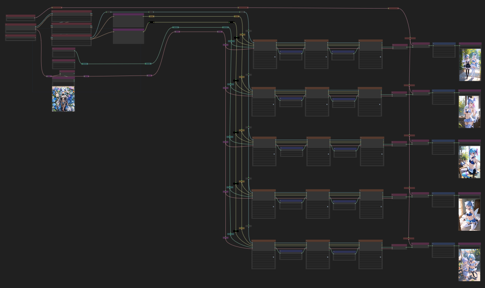

# wyrde's checkpoint tester

Uses [WAS nodes.](https://github.com/WASasquatch/was-node-suite-comfyui) and [lucianocirino's efficiency-nodes](https://github.com/LucianoCirino/efficiency-nodes-comfyui)
* Install them to avoid a mess of red boxes.

## About

This workflow quickly generates a few images along with some (extremely basic) hi-rez fixes to check how well a model work swith some favoite lora and prompts. Nothing fancy. It's not about making great images--just checking it out.

Previews can be enabled by switching the "preview_image" setting on the _KSampler (Efficient)_ nodes.

Adjustintg the upscale factor can turn this into a decent hi-rez fix workflow.

<!-- ## another heading

## Versions
 -->
 
## Example Results

* images
<!--  -->

## resources

<!-- things people might want to duplicate results -->

Model
* facebomb https://civitai.com/models/7152/facebombmix
* 2xPNSR upscale https://drive.google.com/drive/folders/1ldwajXL50uC7PCS63B4Wato6Dnk-svNL

Lora
* https://civitai.com/models/8217/fashion-girl
* https://civitai.com/models/10088/taf-is-all-you-need
* https://civitai.com/models/30941

Embeds
* EasyNegative https://civitai.com/models/7808/easynegative
* bad-hands-5 https://huggingface.co/yesyeahvh/bad-hands-5/tree/main

Custom Nodes
* [WAS Suite](https://github.com/WASasquatch/was-node-suite-comfyui)
* [efficiency-nodes](https://github.com/LucianoCirino/efficiency-nodes-comfyui)

<!-- will likely forget to doublecheck this -->

<a href="..">[back]</a><a href="../../../.."> [home]</a>

