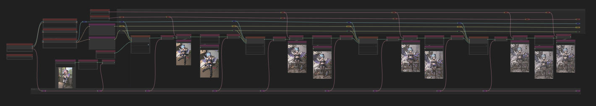

# multi sample pixel space sharpening
I think this is a good name for it. Not sure.

Takes an image from text prompt and
* samples it
* uses a model to upscale
* resamples it
* repeats
* at the end, uses uses a 4x upscale model to increase the size again
* saves it at a total of x8 size

Basically a series of hi-res fixes then an model upscale

Moving noodles switches between model vae and vae loader.

## Example

## Variations

* [with latent upscaling.](../multi-sample-sharpening/)
* [Using the standard image upscale nodes](./multi-sample-pixel-space-sharpening-b.json)
* [a fast one with smaller images sizes](./multi-sample-pixel-space-sharpening-c.json) to "check it out" sort of thing.
* [adjusted image sizes, added img2img nodes, cleaned up some lines and nodes](./multi-sample-pixel-space-sharpening-d.json) 

* [save filename prefix nodes](./multi-sample-pixel-space-sharpening-e.json)

## Resources

WAS nodes
* https://github.com/WASasquatch/was-node-suite-comfyui

Model
* https://civitai.com/models/8281/perfect-world

Uspcale
* Lollypop https://drive.google.com/u/1/uc?id=10h8YXKKOQ61ANnwLjjHqXJdn4SbBuUku&export=download
* PSNR https://drive.google.com/drive/folders/1ldwajXL50uC7PCS63B4Wato6Dnk-svNL

Embeds
* EasyNegative https://civitai.com/models/7808/easynegative

## Credit
Original workflow from davemane42

* based on reddit post https://www.reddit.com/r/StableDiffusion/comments/124xv9v/paradise_and_stone/

<a href="..">[back]</a><a href="../../../.."> [home]</a>

