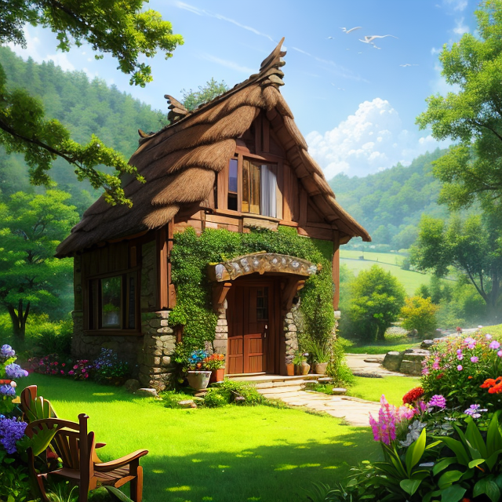
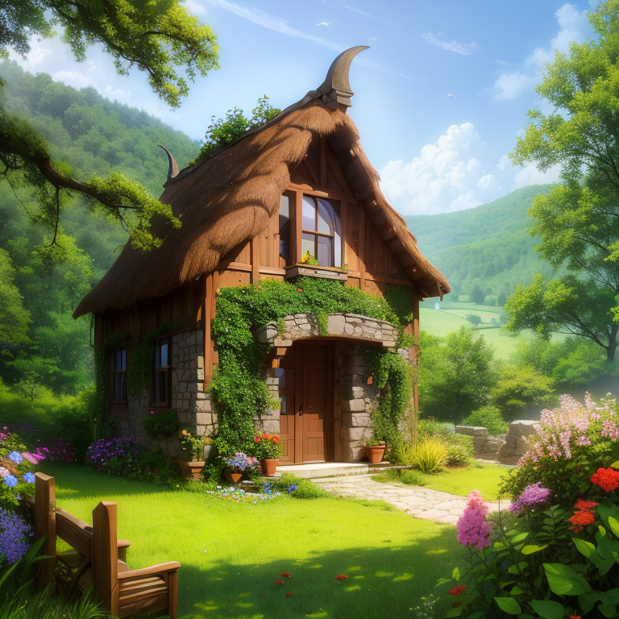

# wyrde multi sample sharpening with model upscale

Takes an image from text prompt and
* samples it
* latent upscales
* resamples it
* repeats
* uses a 4x upscale model to increase the size again
* saves it at a total of x8 size

Basically a series of hi-res fixes then an model upscale

Moving noodles switches between model vae and vae loader.

## Example
1st Gen: 512x512 
2nd Gen: 640x640 
3rd Gen: 768x768 
4tth Gen 1024x1024 
then it is model upscaled with lollypop x4 (not shown since 26mb image)

## Resources

WAS nodes
* https://github.com/WASasquatch/was-node-suite-comfyui

Model
* https://civitai.com/models/8281/perfect-world

Uspcale
* Lollypop https://drive.google.com/u/1/uc?id=10h8YXKKOQ61ANnwLjjHqXJdn4SbBuUku&export=download

Embeds
* EasyNegative https://civitai.com/models/7808/easynegative
* bad-hands-5 https://huggingface.co/yesyeahvh/bad-hands-5/tree/main

## Credit
Original workflow from davemane42 via https://www.reddit.com/r/StableDiffusion/comments/124xv9v/paradise_and_stone/

