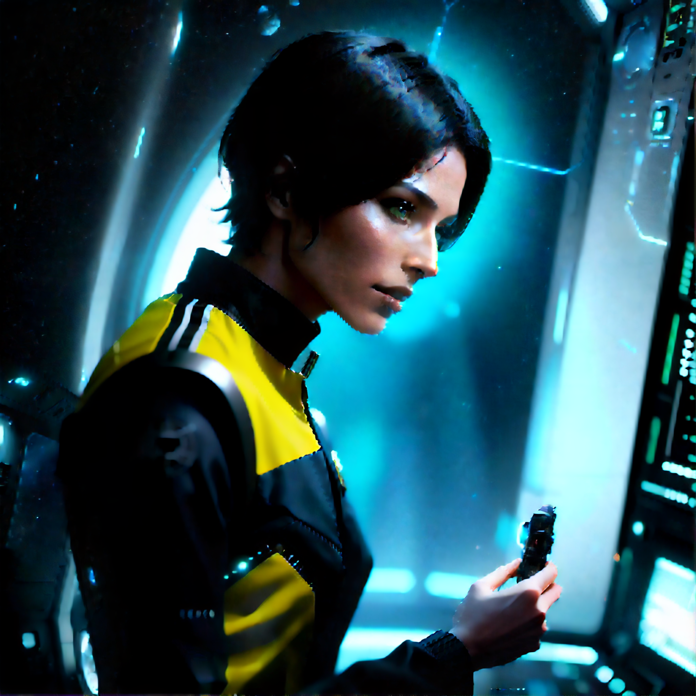

# Tiled Sampling Example

Uses blenderneko's [Tiled KSampler node](https://github.com/BlenderNeko/ComfyUI_TiledKSampler)

<!--

-->

## Purpose

This workflow uses tiled sampling to sample large images in hirez fixes. The Tiled KSampler is similar to the Advanced KSampler node, so there's a couple imporant differences from the "standard" KSampler.
* denoise is handled through start and stop steps compared to total steps.
* using 30 steps, start at step 15 and end at step 30 (15 steps) is equivalent to 0.500 denoise.
* Tile Width and Height should be the maximum size the GPU can reasonably handle.
  * setting these values low can result in extra artiftacts and noise

## Versions

## Example Results

* images  
  
  

When tile size is too small:  

<!--  -->

## resources

<!-- things people might want to duplicate results -->

Model
* https://civitai.com/models/21916/

Custom Nodes
* [blenderneko's [Tiled KSampler node](https://github.com/BlenderNeko/ComfyUI_TiledKSampler)

<!-- will likely forget to doublecheck this -->

<a href="..">[back]</a><a href="../../../.."> [home]</a>

