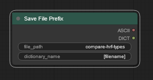
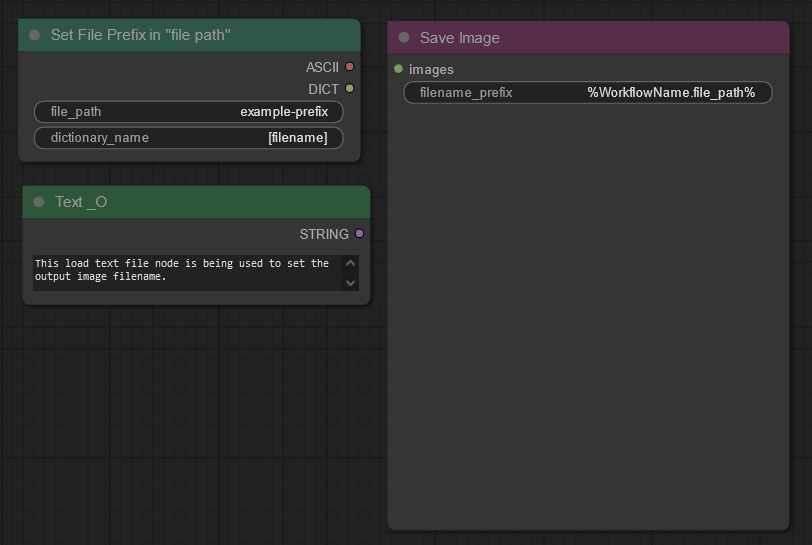
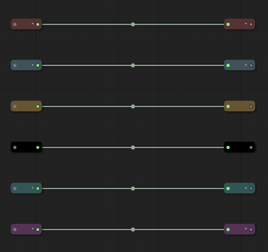

# wyrde's template sharing
Rather than complete workflows, _templates_ are collections of nodes used to mtake building workflows quicker. There isn't (yet) a way to share templates directly between users, but importing them is fairly easy.

How to add templates
* Download one of these json files.
  * Click the file in the list above.
  * Click the RAW button in the upper right.
  * CTRL-S to save the result.
* In ComfyUI, click the Clear button to empty the workspace.
  * Click the Load button
  * Select the json file from before
* In the workflow, highlight the nodes
  * right click on the empty workflow and select "Save selected as template"
  * Give it a name
* it should now be in the template list!

<!--  -->

## Templates

* A node to [set custom savefile](https://raw.githubusercontent.com/wyrde/wyrde-comfyui-workflows/main/templates/tem.savefile.prefix.1.json) (uses a was node). 
* the above, but with a [matching save image node](https://raw.githubusercontent.com/wyrde/wyrde-comfyui-workflows/main/templates/tem.savefile.prefix.2.json) 
* Pairs of [reroute nodes](https://raw.githubusercontent.com/wyrde/wyrde-comfyui-workflows/main/templates/tem.reroute.nodes.1.json) color sorted 

* images
<!--  -->

## resources

<!-- things people might want to duplicate results -->

Custom Nodes
* [WAS Suite](https://github.com/WASasquatch/was-node-suite-comfyui)

<!-- will likely forget to doublecheck this -->

<a href="..">[back]</a><a href="../../../.."> [home]</a>

