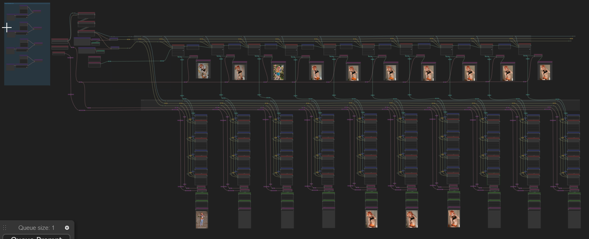

# wyrde's terribly complicated multi latent fixing and fiddling

Makes extensive use of [WAS nodes.](https://github.com/WASasquatch/was-node-suite-comfyui)
* Install WAS suit and avoid a mess of red boxes.

## The Principle of the Thing

Based on a  workflow.

WAS was kind enough to write a nifty node that allows _tokens_ to be set via ascii/text nodes. This hugely simplified the random prompt generation in the previous workflow. 

So, of course, I **had** to make it more complicated.

This workflow
* generate a series of images which SD repeatedly samples.
  * they tend to improve slowly, but sometimes have wild changes
  * the images are then hi-rez fixed and upscaled
* Uses a prompt with a high degree of randomness
  * figure, hair, ears, & clothing. More elements can be randomized with these as examples.
  * values are picked from a list, then assigned to a token. The tokens can then be evaluated in other areas.
* Like before, I wanted all the prompt data to be shared with the image.
  * In comfyui, words in {curly braces | separated by | pipes are | used to | generate} random results. Due to the way comfyui functions, an image's workflow will contain only the items in the prompt which were evaluated for the image. Other random elements will be dropped.

## The workflow
* Generates a text prompt from several randomized lists
* the sections are assigned to tokens.
* the prompt is sampled and tokens evaluated
* sampled again
* and again -- 10 times in all.
* The resulting samples are then hi-rez fixed and upscaled.

The entire process takes around 30 mins on my 1060gtx

Includes some lora. There's also a places where moving noodles changes the generation.

## Versions
* v1.0 - it's a mess, yo
* v1.1 - added img2img nodes, cleaned up lines, better grouping

## Example Results

Eventually, I'm tired.

<!--  -->

## resources

I need to change these to match. Will do it tomorrow.

Model
* https://civitai.com/models/4384/dreamshaper

Lora
* https://civitai.com/models/8858/maplestory2game-chibi-style-hn
* https://civitai.com/models/21670/astrobabes
* https://civitai.com/models/25803/battle-angels

Embeds
* EasyNegative https://civitai.com/models/7808/easynegative
* bad-hands-5 https://huggingface.co/yesyeahvh/bad-hands-5/tree/main

<a href="..">[back]</a><a href="../../../.."> [home]</a>

