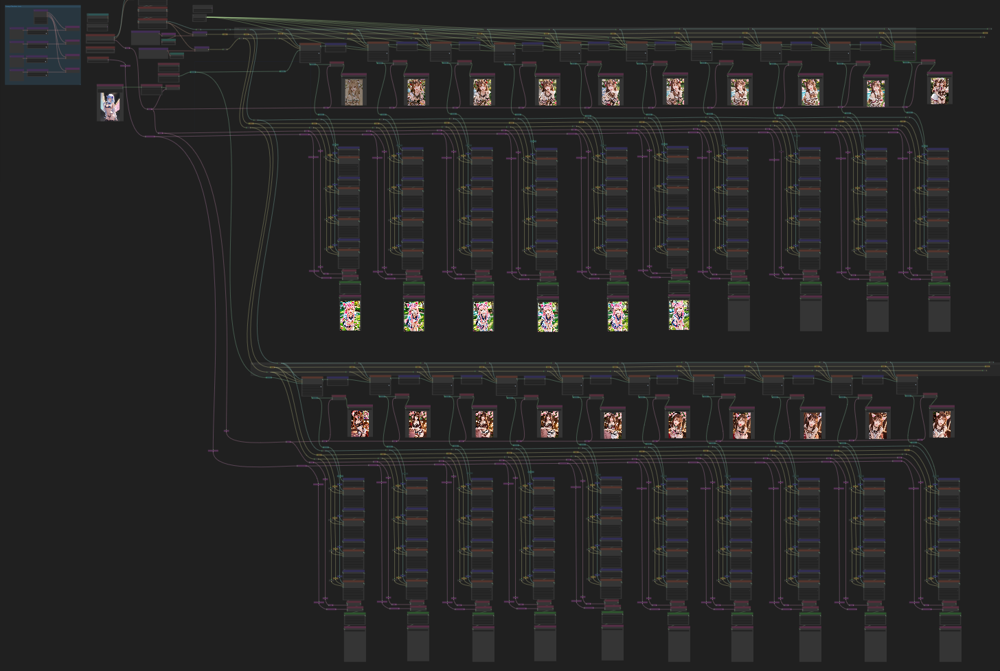

# wyrde's terribly complicated multi latent fixing and fiddling

Makes extensive use of [WAS nodes.](https://github.com/WASasquatch/was-node-suite-comfyui)
* Install WAS suit and avoid a mess of red boxes.

## The Principle of the Thing

Based on a  workflow.

This is a more complicated version of the more complicated predecesor.

This workflow
* generates 2 images.
* each image is then sampled 10 times
  * then each of those is sampled 3 times
* Uses a prompt with a high degree of randomness
  * figure, hair, ears, & clothing. More elements can be randomized with these as examples.
  * values are picked from a list, then assigned to a token. The tokens can then be evaluated in other areas.
* Like before, I wanted all the prompt data to be shared with the image.
  * In comfyui, words in {curly braces | separated by | pipes are | used to | generate} random results. Due to the way comfyui functions, an image's workflow will contain only the items in the prompt which were evaluated for the image. Other random elements will be dropped.

## The workflow
* Generates a text prompt from several randomized lists
* the sections are assigned to tokens.
* the prompt is sampled and tokens evaluated
* sampled again
* and again -- 10 times in all.
  * The resulting samples are then sampled again.
* the above is done again with a second image
* does 80 samples and drops 40 images

The entire process takes around 19 mins on my 1060gtx

Includes some lora. There's also a places where moving noodles changes the generation.

## Versions
* multi-sample-latent-fixing-x40-v1.2

## Important Note
* in order to run properly, the workflow needs a fix as talked about [here](https://github.com/wyrde/wyrde-comfyui-workflows/tree/main/basics/token-random-example)
* or put `{ | | }` in the prompt.

## Example Results

Nah, that's a lot of images.

<!--  -->

## resources

I didn't pay much attention to these. 

<a href="..">[back]</a><a href="../../../.."> [home]</a>

